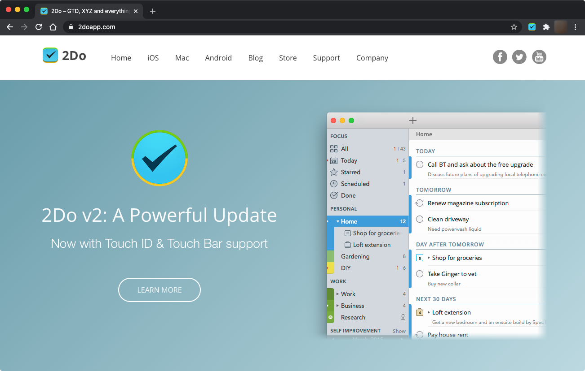
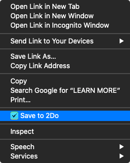
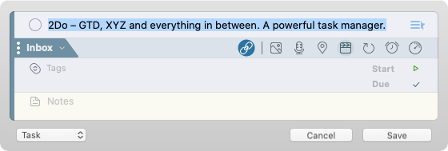
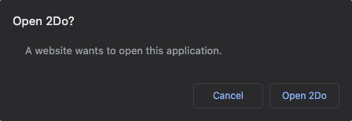

# Save to 2Do

Chrome extension that add a toolbar button and a context menu action to save a link to the current tab to 2Do.







## "A website wants to open this application" popup

When using the extension you might get this popup:



[That's a known issue.](https://superuser.com/questions/1492714/chrome-prompting-for-custom-protocol-handlers-every-time-after-update) There used to be a checkbox on that popup that allowed Chrome to remember your choice, but it was removed with Chrome 77.

A way to make that popup go away is by adding the `twodo://` protocol to the `[URLWhitelist](https://cloud.google.com/docs/chrome-enterprise/policies/?policy=URLWhitelist) via this command:

```
defaults write com.google.Chrome URLWhitelist -array-add 'twodo://*'
```

Once added it will show up in `chrome://policy/`.
